# Introducción a Maven y Git.
Maven es una herramienta de gestión de proyectos en Java que facilita la compilación, empaquetado y gestión de dependencias mediante un archivo pom.xml.
Git es un sistema de control de versiones distribuido que permite gestionar cambios en el código, colaborar en equipo y mantener un historial en modificaciones.
Adelante encontrarás un ejemplo de como usar estas herramientas.
Instalacion de maven
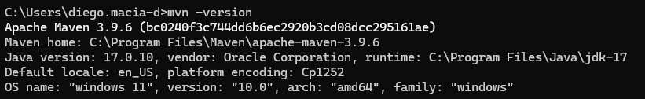

Inicializacion de un proyecto con Maven
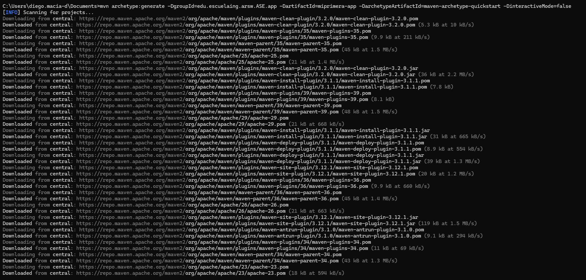

Estructura del proyecto
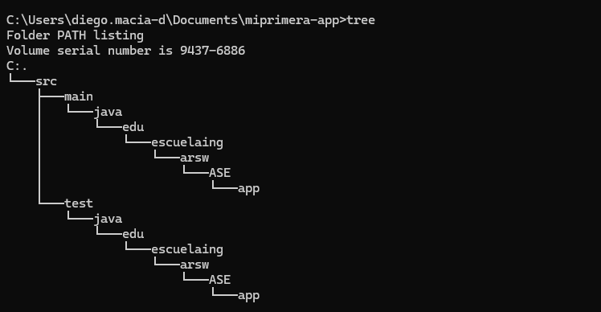
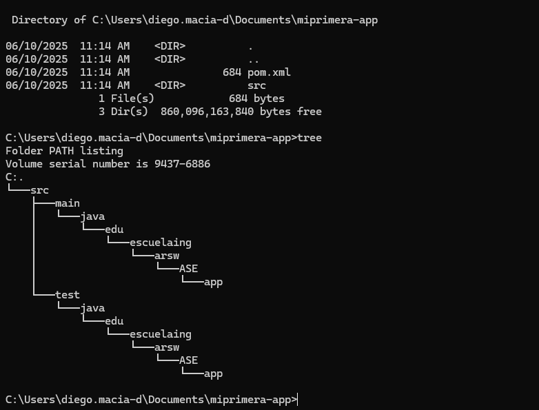

Pom.xml
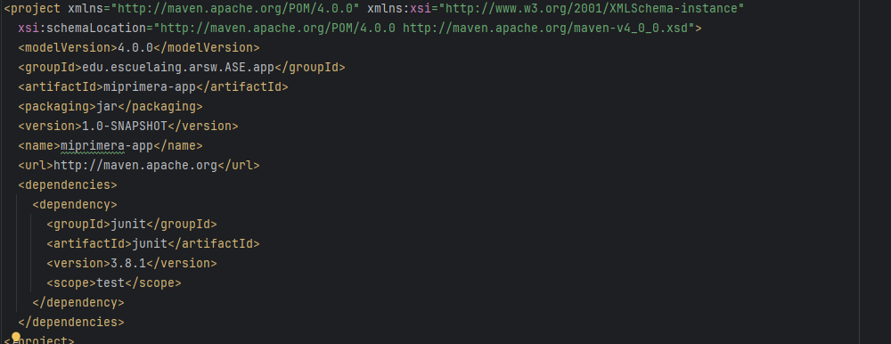
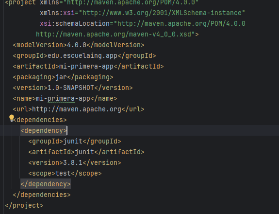

Mvn package para contruir el proyecto
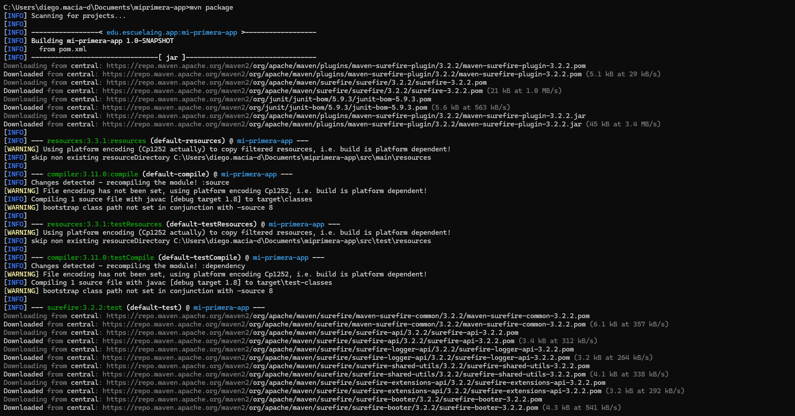

Ejecutar el proyecto
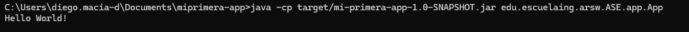

Creacion de src/site/resources
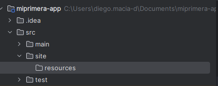

Instalacion de Git
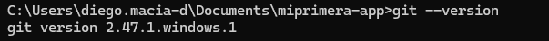

Configuracion global de Git
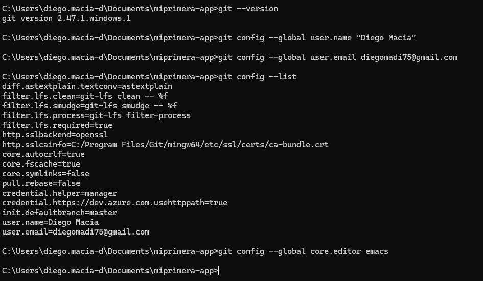

Inicializacion repositorio
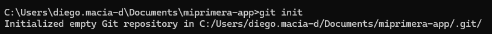

Añadir archivos al area de stage
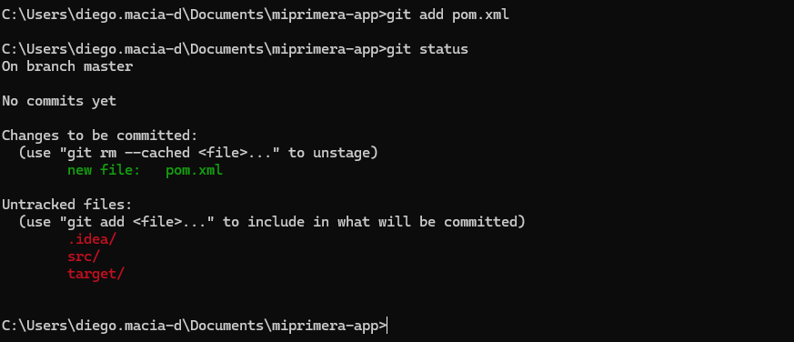

Commit de los archivos agregados
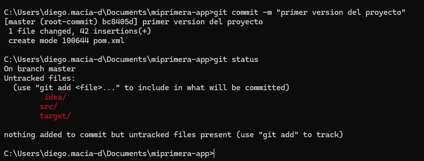

Creacion del repositorio
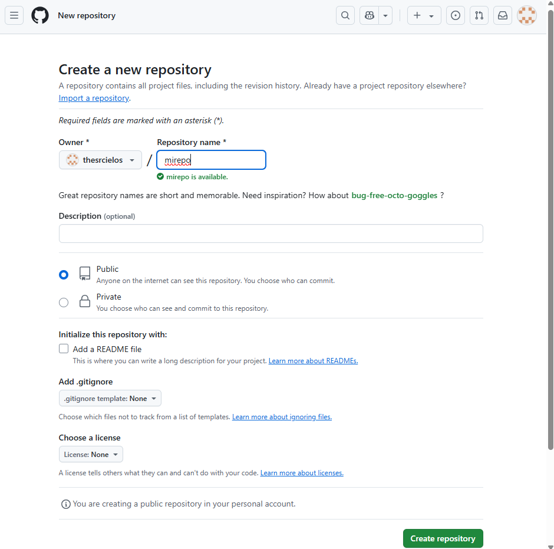

Vincular el repositorio de Github a Git
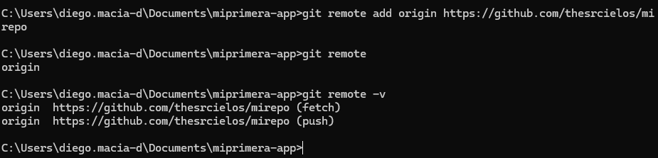

Hacer push al repositorio remoto
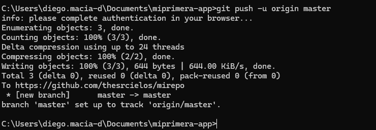

Realizar de nuevo los pasos anteriores con un nuevo proyecto
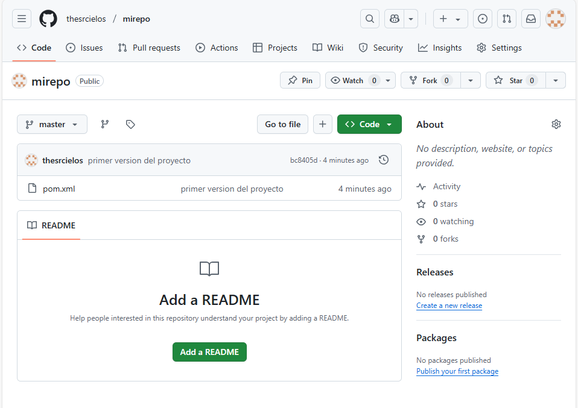
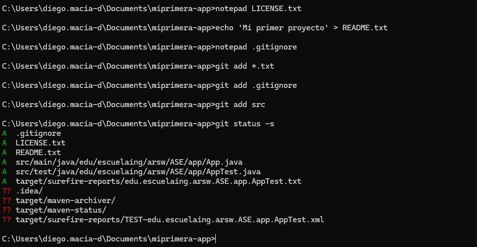
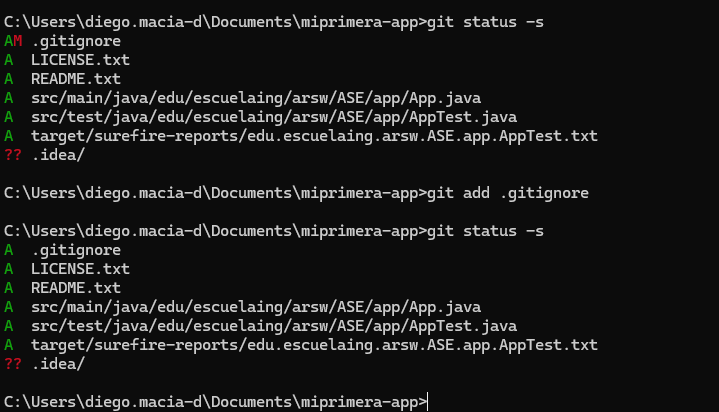
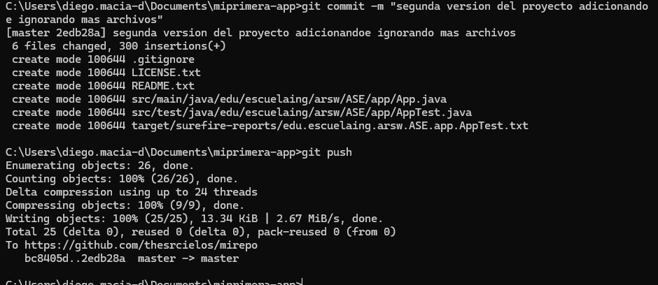
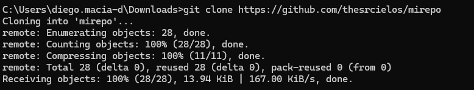
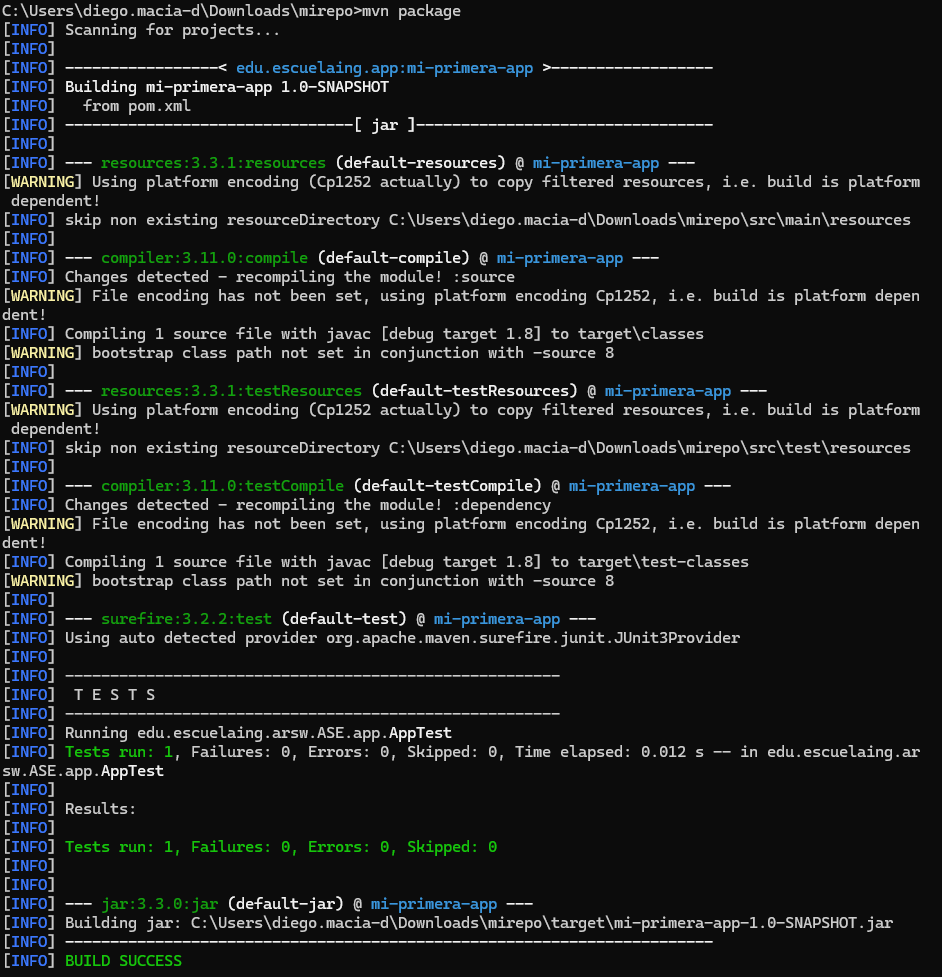
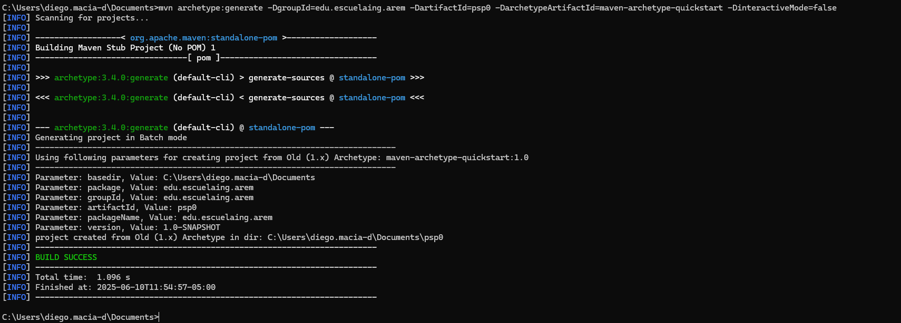
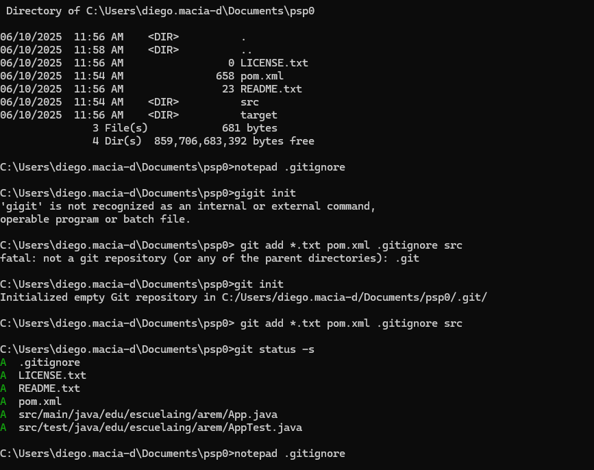
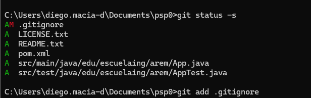
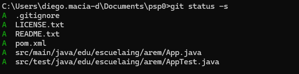
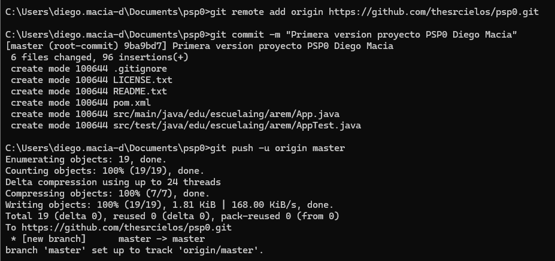
